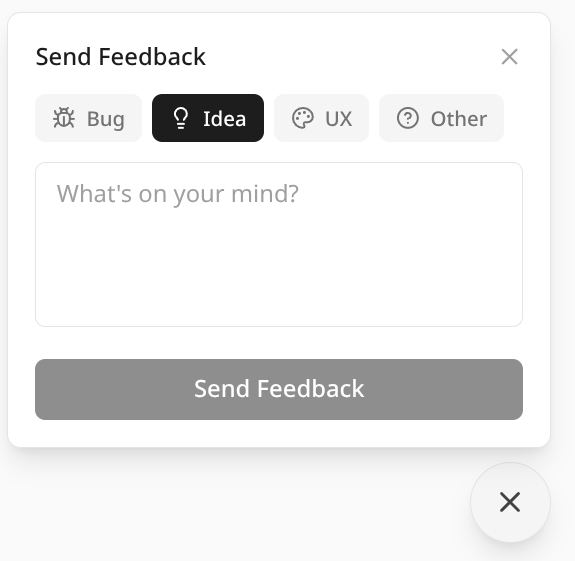

# Harken Web Example (Next.js + Tailwind)

An opinionated example of integrating Harken feedback into a Next.js web application using Tailwind CSS, Lucide icons, and Sonner toasts.

This is a reference implementation — copy the files into your project and adapt to your design system.



## What's Included

- **`src/lib/harken.ts`** — Harken API client for web
  - Reads publishable key from `NEXT_PUBLIC_HARKEN_PUBLISHABLE_KEY`
  - Anonymous ID via `localStorage`
  - Automatic `platform: "web"` metadata
- **`src/components/feedback-widget.tsx`** — Floating feedback button + popover form
  - Category selector (Bug, Idea, UX, Other)
  - Textarea with submit
  - Click-outside and Escape to dismiss
  - Loading state with spinner
  - Toast notifications on success/error
  - Light/dark mode support
  - Graceful no-op when publishable key is missing

## Dependencies

```bash
npm install lucide-react sonner
```

Assumes your project already has:

- Next.js 14+ (App Router)
- Tailwind CSS
- TypeScript

## Setup

1. Copy `src/lib/harken.ts` and `src/components/feedback-widget.tsx` into your project.

2. Add your publishable key to `.env.local`:

   ```
   NEXT_PUBLIC_HARKEN_PUBLISHABLE_KEY=pk_live_your_key_here
   ```

3. Add the widget to your root layout:

   ```tsx
   // app/layout.tsx
   import { FeedbackWidget } from "@/components/feedback-widget";
   import { Toaster } from "sonner";

   export default function RootLayout({ children }: { children: React.ReactNode }) {
     return (
       <html lang="en">
         <body>
           {children}
           <FeedbackWidget />
           <Toaster />
         </body>
       </html>
     );
   }
   ```

Get your publishable key from the [Harken Console](https://console.harken.app).

## Customization

### Colors

The widget uses Tailwind's `neutral` palette with `dark:` variants. Replace with your design tokens:

```tsx
// Before
"bg-neutral-900 text-white";

// After (your brand)
"bg-indigo-600 text-white";
```

### Custom Metadata

Pass additional metadata with feedback submissions. Edit `handleSubmit` in the widget:

```tsx
await submitFeedback({
  message: message.trim(),
  category,
  metadata: { page: window.location.pathname },
});
```

### Toast Library

The widget uses [Sonner](https://sonner.emilkowal.dev/) for toasts. Swap for your preferred library by replacing the `toast.success` and `toast.error` calls.
