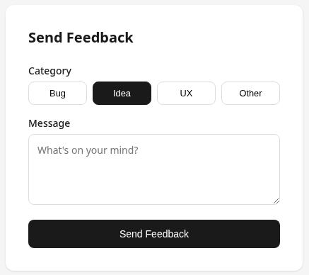

# Harken Web Example (Vanilla)

A minimal, framework-agnostic example of integrating the Harken feedback API into a web application.

No build tools, no framework, no SDK package required — just `fetch` and the browser.



## What's Included

- **`src/harken.js`** — Lightweight web client for the Harken API (~65 lines)
  - Anonymous ID generation + persistence via `localStorage`
  - Automatic `platform: "web"` metadata
  - JSDoc-typed `submitFeedback` function
- **`index.html`** — Simple feedback form demo

## Quick Start

1. Replace the publishable key in `index.html`:

   ```js
   const PUBLISHABLE_KEY = "pk_live_your_actual_key";
   ```

2. Serve the directory with any static file server:

   ```bash
   npx serve .
   ```

3. Open http://localhost:3000 and submit feedback.

Get your publishable key from the [Harken Console](https://console.harken.app).

## Using `harken.js` in Your Project

Copy `src/harken.js` into your project and call `submitFeedback`:

```js
import { submitFeedback } from "./harken.js";

await submitFeedback({
  publishableKey: "pk_live_xxx",
  message: "Love this feature!",
  category: "idea",
  metadata: { page: "/settings" },
});
```

The client automatically:

- Generates a stable anonymous ID (stored in `localStorage`)
- Sets `platform: "web"` in metadata
- Throws on non-2xx responses with the error body

## Browser Requirements

- `fetch` (all modern browsers)
- `localStorage` (for anonymous ID persistence)
- `crypto.randomUUID()` (Chrome 92+, Firefox 95+, Safari 15.4+)

## Adapting for Your Stack

This client works anywhere `fetch` and `localStorage` are available:

- **React/Vue/Svelte** — Import and call from event handlers
- **Next.js** — Use in client components (it accesses `localStorage`)
- **Server-side** — Replace `localStorage` with a cookie or session-based ID
